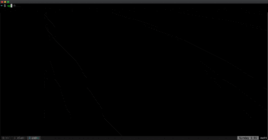

sp
===

`sp` is a utility to allow you to quickly split your tmux window in different panes.




Installation
===

Installing `sp` is very easy: you just need to clone this very same repo at the latest release and then source the `sp.sh` file in your bash profile. Here's how I do it in my [dotfiles](https://github.com/mattmezza/dotfiles) (see plugins.sh and plugins.txt).

```bash
git clone --branch 1.0.0 git@github.com:mattmezza/sp.git && source sp/sp.sh
```
Usage
===

What follows is the output of `sp -h`, accessible at any time.

```
Usage:
    sp SPLIT SPLIT ... SPLIT PANE

SPLIT:
    three-chars string with direction (v|h) and percentage
 PANE:
    selected pane at the end of the split

Examples:
    $ sp v20 h50 0
    $ sp v25 h33 h33 0
```

You can also define some nice alias such as:

- `alias ide=sp v20 h50 h50 0` to have a bottom bar halved

Development
===

Developing `sp` is quite easy. Clone the repo and start editing the `sp.sh` file. You can always source your verions and test it in your shell.


TODOs
===

- Add support for in-the-middle selection of pane: `sp v20 h50 0 h50` to have a bottom row halved at 20% and a top 80% row halved too
- maybe rename actual v to h cause I don't think it makes sense as it is now
